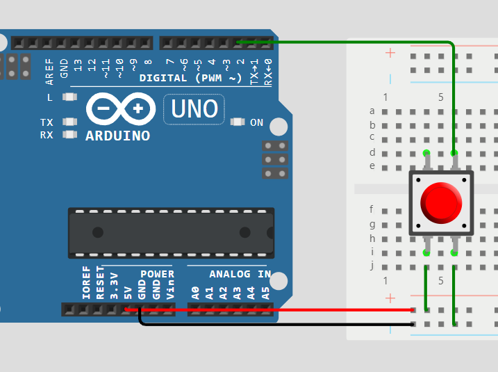

# This project come from this repo : 
[ArduinoML-Kernel]("https://github.com/mosser/ArduinoML-kernel")

# Branch description

In order to discover Domain Specific Langages, we have to custom this code to add multiple features.

Generator : .aml ➡️ .ino

To test our code, we use this website : [Arduino Emulator Online](https://wokwi.com/projects/new/arduino-uno)

# Extension :
**"Pushing a button activates a LED and a buzzer. Releasing the button switches
the actuators off."**

# Code description

## Led
To activate the LED when button is activated, we have to find it pin number.

LED 'l' Pin : 13

After that, we have to add an external button in our system. We have choosen the pin number 2 to read the button value.

## The Code Modification

Comparing to the original code, we had to change only one variable, which was the 'actuator red led' in the file 'FristExample.aml'. Switching it from '12' to '13'